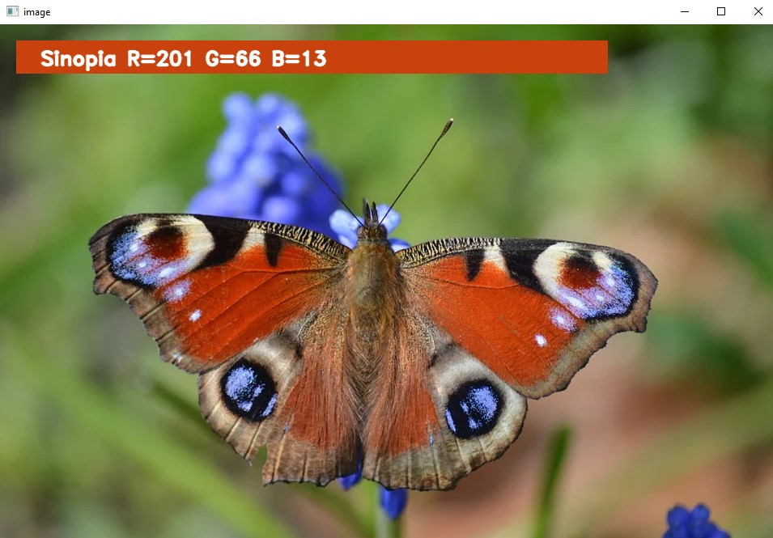

# Color Detector with OpenCV

### Welcome to Color Detector
This Python script utilizes OpenCV to detect colors within an image interactively.

### Instructions
1. Run color detector with command python "color_detector.py -i <add your image path here>" in your folder where you have the files. You can use my 3 pre-existing pics or your own pictures! For example: color_detector.py -i butterfly.jpg
2. By double-clicking on a pixel, it reveals the color's name along with its RGB values. 
3. When youre ready just hit ESC key and the programm will shut down.

### TODO
- Option to use videos and gifs

### 
I used a ready made dataset that contains RGB values with their corresponding names. The CSV file for the dataset has taken by here: [ColorDataSet](https://github.com/codebrainz/color-names/blob/master/output/colors.csv). The colors.csv file includes 865 color names along with their RGB and hex values. Credits to whoever made that!